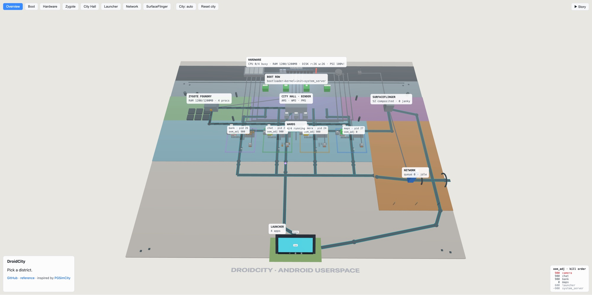

# DroidCity

**How Android runs, as an explorable 3D city.** Live at **[thuat.dev/droidcity](https://thuat.dev/droidcity/)** · inspired by [PGSimCity](https://nikolays.github.io/PGSimCity/).

*Two apps running. Read the board back to front: the hardware strip and boot row across the top, the core-process band (Zygote · system_server · SurfaceFlinger) below them, app processes on the next band down, the installed-package shelves and SystemUI off to the west, the radio edge east, and the phone itself at the front, mid permission dialog. Bottom-right is the live `oom_adj` kill order.*

One machine board, laid out as the Android stack itself, read it north to south: hardware → kernel/boot → core processes → app wards → the glass. Every running app rises as its own walled ward, and the display at the front edge is a working phone screen. Everything is live: hover any structure for what it teaches, tap an icon on the glass and follow the launch across the board.

## The bands, north to south

| Band | What lives there |
|---|---|
| **Hardware strip** | CPU cores · RAM bank (with copy-on-write Zygote pages) · disk · radio/NIC mast feeding the network tower · live PSI pressure · memory and storage buses |
| **Boot Row** | bootloader → kernel → init → system_server |
| **Core processes** | **Zygote** (the foundry) forks every process · **system_server** (the city hall), cast next door and residing next door: ActivityManager approves launches and writes `oom_adj`, WindowManager owns the starting window, PackageManager resolves Intents · **SurfaceFlinger**, every frame's last stop before glass |
| **App processes** | One ward per running app, sitting directly on top of the framework band, so every Binder road is a short hop down to system_server |
| **Packages** (west board) | `/data/app`, one shelf per installed APK (dex · resources · `lib/<abi>` · manifest) and **dex2oat**: install-time AOT, JIT at runtime, profile-guided recompiles while idle-charging. Its road carries PMS's Intent resolution |
| **Network Tower** (radio edge) | DNS → connect → TLS → TTFB → download, retries with backoff, pooled connections skip the handshakes |
| **The Glass** (front) | The phone screen, plus **SystemUI** (its own process: status bar, nav bar, shade, Recents). The launcher has no building of its own, its body *is* the icon grid on that screen. Every tap runs the **input path** north to InputDispatcher in system_server |

## Inside a ward

Every running app is its own walled **ward**: the metaphor for a sandboxed process. On-board labels use the real Android names; the city language lives in the tooltips, panels, and story. Inside a ward:

- **Main road**, the Looper, with the ANR watchdog riding it
- **Worker-pool lane**, coroutine/executor IO that posts results back to the main road
- **Thread rack**, main, RenderThread, Binder pool: private stacks, shared heap
- **Service annex**, long-running background work
- **Activity tower**, rises from a ContentProvider slab and Application floor through the lifecycle floors, with a back stack of rooms and a ViewModel on the roof
- **Render bench**, races each frame to SurfaceFlinger
- **Heap yard**, allocations, with GC sweeps traveling through
- **Room DB shed**, cache hits; its file lives on the DISK, reached over the storage bus
- **Mailbox**, the app's BroadcastReceiver: `onReceive` runs on the main thread with its own ANR budget, and a manifest-declared receiver lets the system start the process just to deliver
- **Window token**, registering the window with WMS is its own step: `addView` → ViewRootImpl → WMS → a Surface allocated by SurfaceFlinger
- **Service annex** promotion, a running Service can go **foreground**: it posts an ongoing notification you can't swipe away, takes `oom_adj` 200 so it outranks cached wards, and its ANR timer tightens to 20s
- **Native workshop + JNI bridge**, the NDK side: a `.so` dlopen'd off the DISK, running in the same process but outside ART. Its **native heap** pile grows on every JNI call and no GC will ever reclaim it; a native SIGSEGV takes the whole process down

Wards rise on launch and are demolished on kill or eviction. `oom_adj` scores and PSI pressure set the LMK kill order; the Zygote foundry stamps out the next one.

## The phone screen is a real UI, not a diagram

- **Home** shows the launcher's icon grid, brand colors, plus a green dot on every app whose process is alive.
- **Tap an icon** and the launch travels for real: touch → InputDispatcher (system_server) → the launcher files an Intent → system_server (AMS) approves → Zygote forks → a ward rises → its first frame lands back on the glass.
- **◁ Back** pops the Activity's back stack, then finishes it at the root, the process stays cached.
- **○ Home** backgrounds the foreground app.
- **▢ Recents** shows one task card per live process; tap one to hot-start it.
- **Notifications**, a background fetch posts one: a dot on the status bar, a row in the shade, and tapping it fires the PendingIntent. It outlives the process, so a killed app cold-starts from its own notification.
- **Runtime permissions**, the camera's first launch raises a system dialog the app can neither draw nor auto-accept; Allow/Deny is recorded by PackageManager.

**Two toggles worth trying:** every ward panel has **UI: Views ⇄ Compose** (relabels the render bench to composition → layout → draw; everything below `draw` is deliberately identical), and the top bar has **Split screen**, which puts two apps on the glass with *both* resumed, Android 10's multi-resume, and lights two bright compositor tiles.

## Background work, and the memory ladder

- **JobScheduler depot** in system_server, WorkManager enqueues; the system decides when. Jobs wait on constraints (network, charging, idle) as amber crates, then light green when dispatched to their app. Killing a process takes its jobs with it.
- **Doze**, a dome over the whole board: the radio goes quiet, ambient launches stop, and nothing deferred runs until you open a **maintenance window**. That's the concept, not a tint.
- **Reclaim before the kill**, memory pressure never jumps straight to a death. While PSI sits high, each step runs a kswapd pass that compresses cold pages into the **zram** block (with diminishing returns); only when reclaim can't keep up does lmkd pick a victim off the `oom_adj` ladder. Press **Allocate 150MB** in any ward a few times to fill memory and watch the whole ladder run.

## Story mode

A guided tour through seven chapters:

1. **Power On**, the boot sequence
2. **A Process Is Born**, tap → Intent → fork → first frame (the new process rises as its own walled ward)
3. **Getting Data**, cache-then-network, stale-while-revalidate
4. **The 16ms Race**, frame pipeline, jank, ANR
5. **Coming Back**, cold/warm/hot starts, services, LMK survival
6. **The Metal**, cores, RAM, disk, PSI pressure → lmkd
7. **While You Sleep**, deferred jobs, Doze and maintenance windows, background notifications, foreground services, and reclaim-before-the-kill

Play chapters individually from the Story menu, or **Play all** to chain all seven with narration. The whole city runs in slow motion so the action matches the words.

## City controls

- **City: auto/manual**, manual stops all self-driven launches and reclaims, so you drive every event (ideal for watching one app end-to-end)
- **Reset city**, SIGKILLs every ward for an empty grid

The companion reference: the full boot-to-pixel flow, a memory-management deep dive, and an audit of what the city models vs. simplifies, lives in [`docs/android-flow-reference.md`](docs/android-flow-reference.md).

## Corrections and contributions

Early prototype: the model simplifies aggressively and certainly contains inaccuracies. The most useful contribution is a correction, if a tooltip, a narration line, or a piece of the flow is wrong, [open an issue](https://github.com/nthuat/droidcity/issues/new) and say what the real behavior is.

Also welcome: Android concepts the city doesn't model yet. `docs/android-flow-reference.md` keeps an honest audit of what's modeled (✅), simplified on purpose (⚠️), and missing (❌), the ❌ rows and the 📖 entries in the concept atlas are the open list.

## Dev

    npm install
    npm run dev     # local
    npm test        # sim + story-player unit tests
    npm run build   # typecheck + static build in dist/
